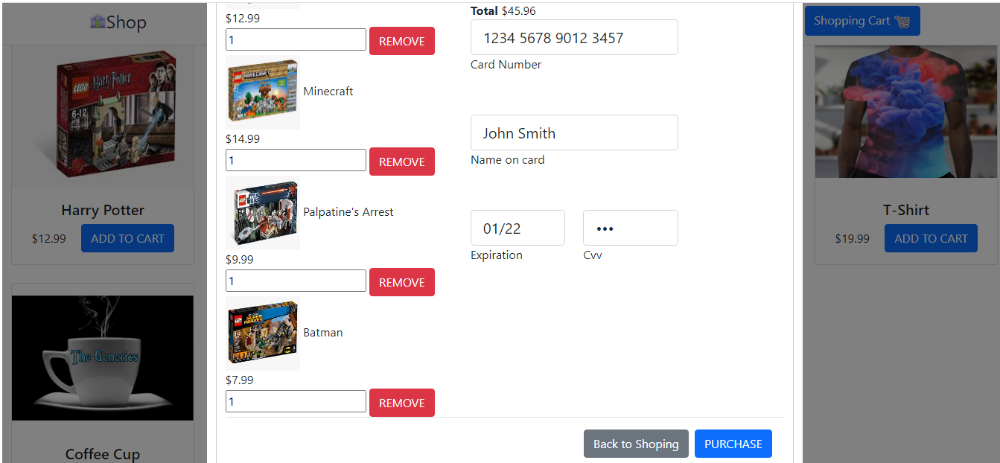

# The Food Delivery app.

## Introduction:

The Food Delivery app based on simple html5 with js script and bootstrap 5.
Application have two pages. First is a shop page with cards of goods with prices. "Add to cart" send item to cart. You can open your cart via button on the header section. Cart page will open through modal window. There you can see added items, total cost, chose quantity of items. After filling the form you can purches your order. 

### Instruction:

To run the app just double click on index.html file (Run with browser like Chrome).

You can also visit deployed app on vercel.com 
<a href="https://delivery-app-gules.vercel.app/">Deploy</a> 

## Result:

